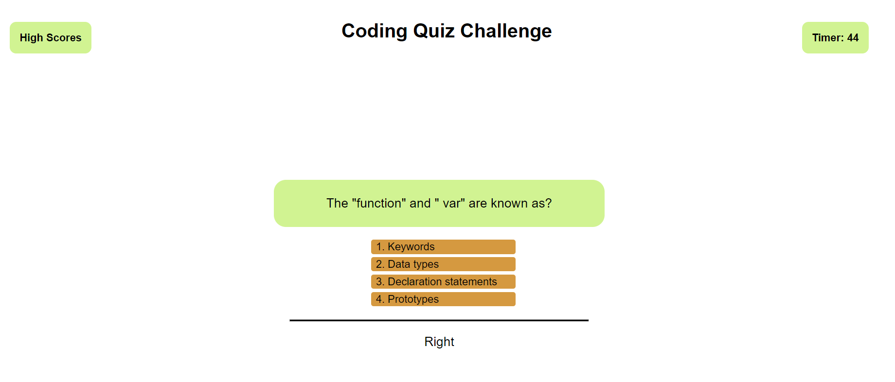

# Week 4 Assignment

## Coding Quiz Application

## Acceptance Criteria

- GIVEN I am taking a code quiz
- WHEN I click the start button
- THEN a timer starts and I am presented with a question
- WHEN I answer a question
- THEN I am presented with another question
- WHEN I answer a question incorrectly
- THEN time is subtracted from the clock
- WHEN all questions are answered or the timer reaches 0
- THEN the game is over
- WHEN the game is over
- THEN I can save my initials and score

### Github URL
https://github.com/zafarfast/zafarfastw4c

### Application URL
https://zafarfast.github.io/zafarfastw4c/

### Screenshots

#### Desktop view

#### Mobile view

#### High scores (Mobile view)

